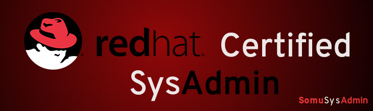

If you're new to this site and have no idea what's going on, first go and read the [About](about.md) section of the blog.

Here's a list of all the major articles this blog contains: 

## [Red Hat Certified System Administrator (RHCSA) Guide]()

{:.lead}

_Red Hat Certified System Admininstrator (**RHCSA**)_ is the most basic course for someone trying to be a SysAdmin which familiarizes a candidate with concepts and commands needed to be a SysAdmin. While other certifications are avialable, the best part about this one is the fact that the examinee has to learn nothting by heart, and must learn to perform all of the tasks listed below (and more). The exam is completely lab-based practical where you're scored on the basis of the tasks that you perform over the period of 2.5 hours and one must score 210/300 to even pass the exam! **And** it's mandatory to pass this exam before you can get the _Red Hat Certified Engineer (**RHCE**)_ certification. 

Some of the skills tested in this exam are:
#### Essential Tools:
* Input redirection
* grep, awk, sed, regular expressions
* ssh
* tar, star, gzip, bzip2
* file and link handling
* ugo/rwx permissions
* locate, read, man, info, and using system documentation in files in `/usr/share/doc`

#### OS Skills:
* Manually booting into different runlevels and interrupting boot process
* Process handling and managing process priority
* Using system logs
* Managing virtual machines (VMs)
* Managing network services and network file transfer

#### File System Management:
* Managing MBR and GPT partitions
* NFS and CIFS file system management
* setgid directory creation and config
* Access Control Lists (ACLs)

#### Configuration and maintenance of systems:
* Static and dynamic hostname resolution and network config
* Cron jobs
* autorun and config services at boot
* Installing RHEL servers as virtual guests
* Virtual machine auto-boot
* Network services auto-start at boot
* Software package install/upgrade from any source
* Kernel update
* Bootloader modification

#### User and Group management:
* Managing users, groups and their passwords, using password aging
* Using an authenticaitn service that already exists for user and group information

#### Security:
* Firewall config and iptables
* SSH keybased authentication
* Permissive and enforcing modes of SELinux
* File and process context listing for SELinux
* Modifying SELinux settings via boolean settings

For detailed article on each of the above topic, and more, go to my [RHCSA course page](). As always, everything on this site is 100% free!
